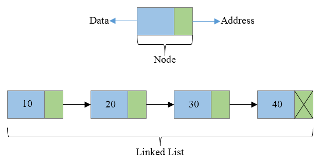

# Linked Lists

1. A linked list is a data structure for storing elements, containing data and a reference to the next node.
2. The first node is the head, and the last node has a null reference indicating the end.
3. Linked lists are widely used in computer science.
4. Each node stores data and a reference to the next node, allowing for efficient addition and removal of elements.

  

