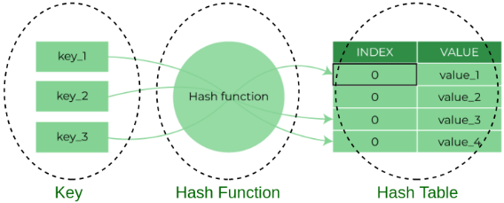
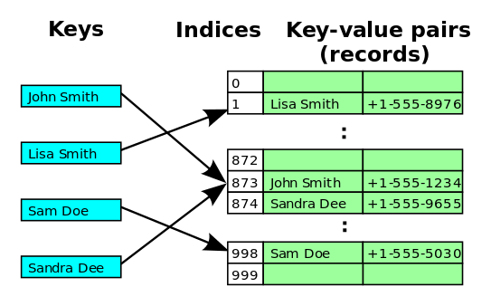

# Hash-Tables

- In computer science, a hash table (also known as a hash map) is a data structure that stores key-value pairs. It provides fast access to values based on keys, making it an efficient way to implement associative arrays or dictionaries.
- The hash table uses a hash function to map each key to an index in an array of buckets. The hash function should generate a unique index for each key, but it's possible for two different keys to have the same index (a collision). To handle collisions, the hash table uses a collision resolution technique, such as chaining or open addressing.
- In chaining, each bucket in the array contains a linked list of key-value pairs that have the same index. In open addressing, when a collision occurs, the hash table probes other buckets until an empty one is found.
- Hash tables have an average case constant-time complexity for insertions, deletions, and lookups (assuming a good hash function and appropriate load factor), making them a popular choice for implementing lookup tables and symbol tables in software applications.

  

## Colissions
What are the two techniques used to handle collisions in a hash table
  - **Separate Chaining**: involves storing all elements that hash to the same bucket in a linked list. When a collision occurs, the new element is added to the linked list of the corresponding bucket. To search for an element, the linked list in the bucket must be traversed. A downside of this method is that a bad hash function can lead to slow lookups if most elements end up in the same bucket stackoverflow.com.
    

    
  

  - **Open Addressing**: is an alternative technique where all elements are stored directly in the hash table itself. When a collision occurs, the algorithm looks for another available slot in the table to store the collided key. There are multiple probing methods used in Open Addressing to find an empty slot, including:
    - Linear Probing: Searches for the next available slot in a linear manner.
    

      
    

    
 
    - Quadratic Probing: Searches for slots using a quadratic function of the original hash value.
    - Double Hashing: Uses a second hash function to determine the next slot to check geeksforgeeks.org.
  
Each probing method has its trade-offs:
  - Linear Probing has the best cache performance but suffers from clustering.
  - Quadratic Probing lies between the two in terms of cache performance and clustering.
  - Double Hashing has poor cache performance but no clustering and requires more computation time as two hash functions need to be computed geeksforgeeks.org.

In summary, Separate Chaining and Open Addressing are the two primary techniques used to handle collisions in a hash table. Separate Chaining uses linked lists to store collided elements, while Open Addressing stores elements directly in the hash table and uses different probing methods to find an empty slot when a collision occurs. Each method has its pros and cons, and the choice of which technique to use depends on the specific requirements of the application.